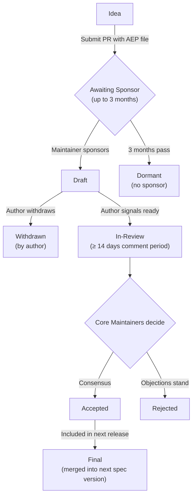

# AEP guidelines

## What is an AEP?

**AEP** stands for **AFI Enhancement Proposal**. An AEP is a design
document providing information to the AFI community or describing a new
feature for the specification, its transport bindings, or the governance
process itself. The AEP should provide a concise technical specification
of the feature and a rationale for it.

AEPs are the primary mechanism for proposing major features, collecting
community input, and documenting design decisions that go into AFI. The
AEP author is responsible for building consensus within the community and
documenting dissenting opinions.

When drafting an AEP, authors should review the
[design principles](design-principles.md), which outline the core values
and tradeoffs that guide AFI's evolution.

AEPs are maintained as markdown files in the
[`aeps/` directory](https://github.com/ucalyptus/afi/tree/main/aeps) of
the specification repository. Their revision history serves as the
historical record of the feature proposal.

## When to write an AEP

The AEP process is reserved for changes substantial enough to require
broad community discussion, a formal design document, and a historical
record. A regular GitHub pull request is often more appropriate for
smaller changes.

**Write an AEP if your change involves:**

- **A new operation or spec change** — adding, modifying, or removing
  operations in the spec, changing schema shapes, adding a new transport
  binding
- **A breaking change** — any change that is not backward-compatible
- **A governance or process change** — altering decision-making,
  contribution guidelines, or the AEP process itself
- **A complex or controversial topic** — changes likely to have multiple
  valid solutions or generate significant debate

**Skip the AEP process for:**

- Bug fixes and typo corrections
- Documentation clarifications
- Adding examples to existing features
- Minor schema fixes that don't change behavior
- New provider adapter notes (informative, not normative — see
  [Providers](../providers/index.md))

Not sure? Open a discussion on the repo before starting significant work.

## AEP types

There are four kinds of AEP:

1. **Standards Track** — describes a new feature or implementation for
   the AFI specification proper (new operations, schema changes,
   transport bindings, conformance profiles).
2. **Informational** — describes a design issue or provides guidelines
   to the community without proposing a normative change.
3. **Process** — describes a process surrounding AFI or proposes a
   change to a process (like this document).
4. **Extensions Track** — describes an extension that will be adopted as
   an `x-` field convention. Follows the same review and acceptance
   process as Standards Track AEPs, but indicates that the proposal is
   for an optional extension rather than a spec addition.

## AEP workflow

## Writing an AEP

1. Copy [`aeps/AEP-TEMPLATE.md`](https://github.com/ucalyptus/afi/blob/main/aeps/AEP-TEMPLATE.md)
   to `aeps/AEP-NNNN-short-name.md` (next unused number)
2. Fill in every section — the template is exhaustive on purpose
3. Open a PR titled `AEP-NNNN: <short name>` with status `Draft` in the
   AEP frontmatter
4. Find a Maintainer or Core Maintainer to sponsor your proposal
5. When ready for formal review, edit the frontmatter status to
   `In-Review`. This starts the ≥ 14-day comment period.
6. An editor (a Core Maintainer) is assigned. They summarize objections,
   seek consensus, and drive the AEP to `Accepted`, `Rejected`, or
   `Deferred`.

## Comment period rules

- **Standard AEPs:** ≥ 14 days
- **Governance / process AEPs:** ≥ 30 days
- **Charter amendments:** ≥ 30 days AND unanimous Core Maintainer
  approval (see [Charter](charter.md#amendment))

## What makes an AEP accept-able

The [design principles](design-principles.md) are the acceptance criteria.
Concretely, a Standards Track AEP is more likely to succeed if it:

- Points to at least one working implementation (demonstration over
  deliberation)
- Explains how the proposal composes with existing operations rather
  than adding parallel primitives (composability over specificity)
- Shows how the change degrades gracefully for older clients or
  providers (interoperability over optimization)
- Includes a deprecation and migration path for anything it removes
  (stability over velocity)

## Adoption after acceptance

An Accepted AEP moves to `Final` when its changes ship in a numbered spec
version. Reference implementations of any new operations SHOULD land in
at least one open-source provider within 90 days of the AEP being
Accepted. If they don't, Core Maintainers may deprioritize related AEPs
until adoption catches up.
