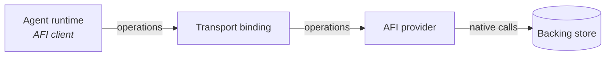

# Architecture

AFI has three roles and four transport bindings. Everything else is layered
on top.

## Roles

- **Provider** — implements the [core operations](../specification/draft/operations/index.md)
  against its backing store. Owns access control, pagination, error mapping.
- **Client** — an agent runtime (or a human tool) that consumes providers.
  Discovers capabilities via [`/.afi/manifest.json`](../specification/draft/basic/discovery.md);
  MUST honor the declared profile.
- **Transport binding** — how the operations travel. AFI defines four:
  [MCP tools](../specification/draft/transports/mcp.md),
  [HTTP/JSON](../specification/draft/transports/http.md),
  [FUSE](../specification/draft/transports/fuse.md),
  and [SSH](../specification/draft/transports/ssh.md).

## The wire is small

Every request maps to one of four verbs and one of two data shapes:

| Verb | Returns | Used for |
|---|---|---|
| `stat` | [`Entry`](../specification/draft/schemas/entry.md) | Metadata for one path |
| `list` | `Entry[]` | Directory contents |
| `read` | `bytes + content_type` | File contents |
| `search` | [`Match[]`](../specification/draft/schemas/match.md) | Locate strings/patterns/vectors across the tree |

Level 3 providers add `write`, `mkdir`, `delete`, `move` — same shape.

## Providers own semantics

A provider decides:

- **How paths map to its store.** For ChromaFs, `/api-reference/users` is a
  Chroma document id. For AgentFS, it's an inode walk. For a D1-backed
  provider, it's a `SELECT` on `fs_dentry`.
- **How search is implemented.** Some providers get exact-string search
  from a filesystem-native tool (`grep`), some from an inverted index
  (SQLite FTS5), some from a vector similarity query, some from all three.
- **How auth works.** AFI mandates that inaccessible paths appear as
  [`not_found`](../specification/draft/basic/access-control.md), but leaves
  token issuance and capability semantics to the provider.

## Clients stay dumb

The [client-side contract](../getting-started/build-a-client.md) is small
enough to implement in an afternoon and stable across providers. Once
integrated, adding a new provider is a URL and a token — no per-provider
code path.

## Composition with MCP

AFI's [MCP binding](../specification/draft/transports/mcp.md) is the
recommended transport because most agent runtimes already speak MCP. An AFI
provider that exposes MCP tools named `afi.stat`, `afi.list`, `afi.read`,
`afi.search` is instantly usable by any MCP client — the AFI shape is the
contract; MCP is the plumbing.

An MCP server that ships tools with those exact names is an AFI provider.
It is possible (and useful) to layer both: a provider that publishes AFI over
MCP *and* over HTTP, so both agent runtimes and humans can hit it.
